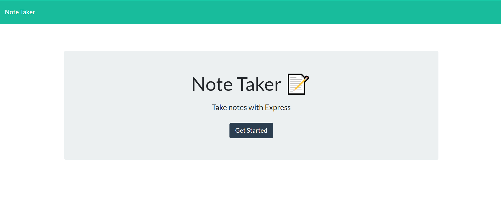
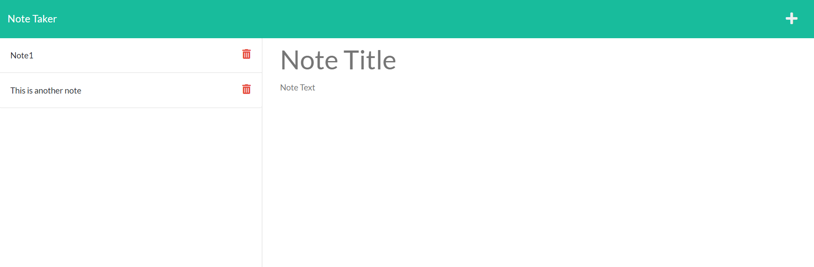
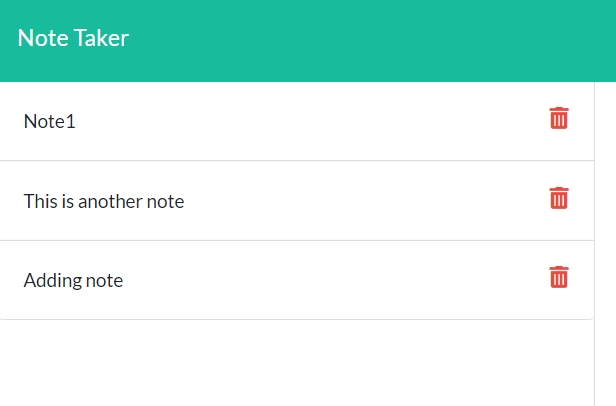
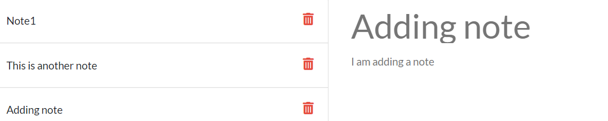

# HW9-Note-Taker

## How to use this application

To begin using this application follow the link below:

https://still-atoll-33363.herokuapp.com/

You will then first see the home page, image below:

Then you need to click get started to go to the notes page.

You will see a list of existing notes on the left hand side. To delete the notes you need to click the delete icon (trashcan icon). If you want to add a new note you can click the plus icon in the top right. If there isn't anything in the fields you can just begin typing. Once you have filled out the note title and note text you will see a save icon appear in the top right next to the new note icon.

when you click this save icon you will see your note added to the column on the left side of the page. To see a previously added note click the note and you will see it reappear on the page.

And thats about it! Very simple application to use. Thank you!